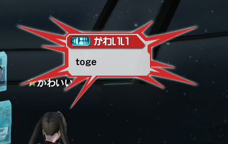
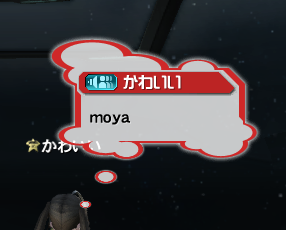
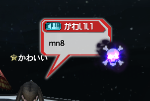
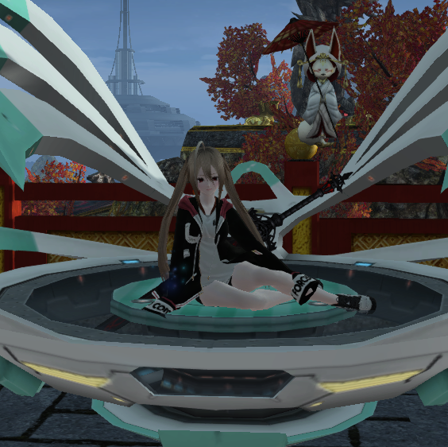
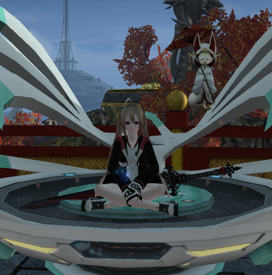
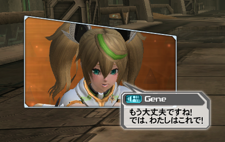
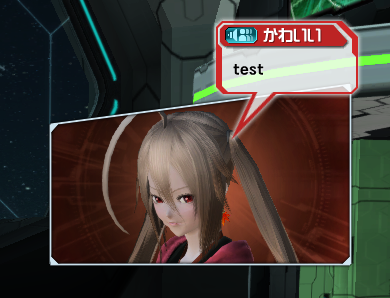
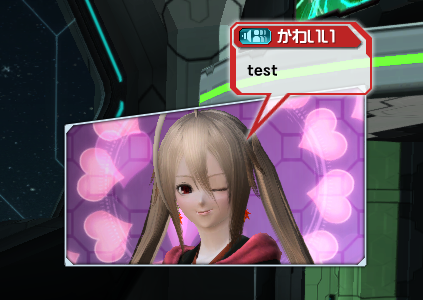
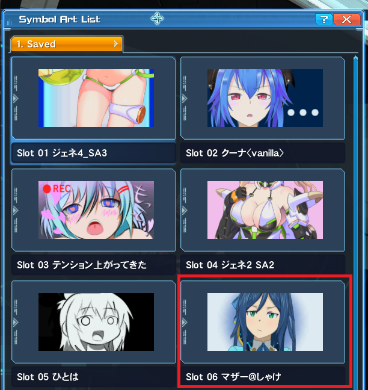
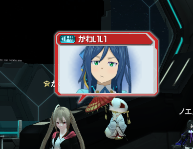

# PSO2_Chat Commands

1. [Phím Tắt](chat_commands.md#1-phím-tắt)
2. [Màu Chữ](chat_commands.md#2-màu-chữ)
3. [Bóng Bóng Thoại]()
4. [Lobby Actions]()
5. [Cut-in Display]()
6. [Symbol Art]()
7. [Voice]()
8. [Misc Stuff]()
9. [Hệ Thống Game]()

## 1: Phím Tắt
- Ấn Enter để mở cửa sổ chat
- Giữ `Ctrl và ấn phím mũi tên trái/phải` để thay đổi mục hiển thị tin nhắn.
- Giữ `Ctrl và ấn phím mũi tên lên/xuống` để dùng lại các câu đã chat trước đó.
- Giữ `Alt và ấn phím mũi tên trái/phải` để thay đổi kiểu gửi tin nhắn.

    Hoặc chat nhanh bằng việc đặt command sau lên trước câu:
    - `/a` : Public Chat
    - `/p` : Party Chat
    - `/t` : Team Chat
    - Whisper và Group Chat không có command, và khi để
- Phím `Scroll Lock` để bật chat mode, gõ phím bất kì sẽ bắt đầu chat luôn, thích hợp dùng khi AFK tại Lobby.

## 2: Màu Chữ
Thay đổi màu chữ bằng việc thêm `{màu}` vào trước đó
`{màu}` có dạng `{3 chữ cái đầu tiên của màu đó trong t.anh}`. VD: `{red}` : màu đỏ, `{blu}` : xanh nước biển,...

Command | Màu
------- | --------------------- 
{red}   | red - đỏ
{ora}   | orange - cam
{yel}   | yellow - vàng
{gre}   | green - xanh lá 
{blu}   | blue - xanh nước biển
{pur}   | purple - tím
{vio}   | pink - hồng
{bei}   | beige - xám tro 
{whi}   | white - trắng
{blk}   | black - đen
{def}   | bỏ màu trước đó

Có thể dùng nhiều lệnh màu trong câu. Copy đoạn sau vô game: `chu binh thương {red} qua mau do {vio} chuyen mau hong {def} ve mau mac dinh` .

## 3: Bóng Bóng Thoại

- `/toge` : biểu thị mấy thoại cần hét lớn 

- `/moya` : biểu thị suy nghĩ thoại

- `/mn#` : # là số từ 1~39. Bong bóng thoại cảm xúc.

VD: `/mn1`, `/mn2`, ..., `/mn39`

## 4: Lobby Actions
Mỗi [LA](thuat_ngu.md#la) đều có 2 dáng cho 2 giới tính. 

- `/fla <command>` để xem LA cho nữ
- `/mla <command>` để xem LA cho nam

Ngoài ra dùng
- `/la <command>` để xem LA cho giới tính của char, đây sẽ là preview mặc định khi nghía LA trên visi. VD char nữ thì dùng sẽ ra LA cho nữ
- `/cla <command>` để coi giới tính trái ngược với giới tính của char. VD char nữ thì dùng sẽ ra LA cho nam và ngược lại

với `<command>` là tên command của LA

`/la la_sit1` | `/cla cla_sit1 `
-- | --
 | 

## 5: Cut-in Display
Bạn có thể hiển thị mặt của char cho mọi ngườI xem kèm các câu thoại.

- Cấu trúc: `/ci<kiểu> <hướng> <tuỳ chọn>`

- Trong đó:

Kiểu biểU cảm khuôn mặt| Hướng quay camera | Tuỳ chọn
-- | -- | --
`1` : biểu cảm bình thường | `1`: phía trước | `nw` : không hiểN thị khung cut-in (như chat bình thường )
`2` : vui | `2` : chéo | `s??` : Thời gian hiện cut-in. `??` thay bằng số giây. VD: `s15`, `s30`.
`3` : tức giận | `3` : chéo trên | `t?` : độ sáng, thay `?` bằng số từ 1~5. VD `t1`, `t2`, ..., `t5`.
`4` : buồn | `4` : chéo dướI | 	
`5` : ngạc nhiên | `5` : cạnh bên | 
`6` : nhắm mắt |  | 
`7` : ngậm miệng |  | 
`8` : vui 2 | | 
`9` : nháy mắt |  | 

VD: 
`/ci3 3 test` | `/ci9 1 t4 test`
-- | --
 | 

## 6: Symbol Art

Sau khi lưu [SA](thuat_ngu.md#sa) thì bạn có thể dùng nó bằng cách gõ `/symbol<số SA>`

 

VD: `/symbol6`

 

## 7: Voice
Dùng command `/vo<số>` để nghe các thoại của voice đÓ. 

Lưu ý: mở loa lên.

Command | Thoại
-- | --
`/vo1` | S-ATK Voice Clips
`/vo2` | R-ATK Voice Clips
`/vo3` | Forward Aiming Technics
`/vo4` | AoE / Recovery Technics
`/vo5` | Minor Damage
`/vo6` | Large Damage
`/vo7` | Upon Revival
`/vo8` | Incapacitated
`/vo9` | Photon Blast
`/vo10` | Special Action
`/vo11` | Charged Attack
`/vo12` | SEGA! (Không phải voice nào cũng có)
`/vo13` ~ `/vo20` | Thoại đặc biệt. 

## 8: Hệ Thống Game

Command | --
-- | --
 

## 9: Khác và Lưu ý
