# PSO2_Chat Commands

1. [Phím Tắt](chat_commands.html#1-phím-tắt)
2. [Màu Chữ](chat_commands.html#2-màu-chữ)
3. [Bong Bóng Thoại](chat_commands.html#3-bong-bóng-thoại)
4. [Lobby Actions](chat_commands.html#4-lobby-actions)
5. [Cut-in Display](chat_commands.html#5-cut-in-display)
6. [Symbol Art](chat_commands.html#6-symbol-art)
7. [Voice](chat_commands.html#7-voice)
8. [Fashion / Selfie](chat_commands.html#8-fashion--selfie)
9. [Trạng Thái](chat_commands.html#9-tr%E1%BA%A1ng-th%C3%A1i)
10. [Khác](chat_commands.html#10-khác)
11. [Lưu ý](chat_commands.html#11-lưu-ý)

 

## 1: Shortcut key
## ( Phím Tắt )
- Ấn Enter để mở cửa sổ chat
- Giữ `Ctrl và ấn phím mũi tên trái/phải` để thay đổi mục hiển thị tin nhắn.  
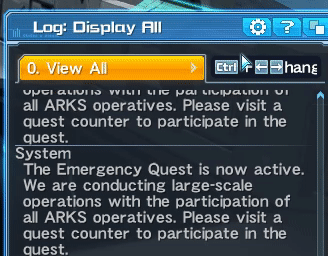
- Giữ `Ctrl và ấn phím mũi tên lên/xuống` để dùng lại các câu đã chat trước đó.  

- Giữ `Alt và ấn phím mũi tên trái/phải` để thay đổi kiểu gửi tin nhắn.  
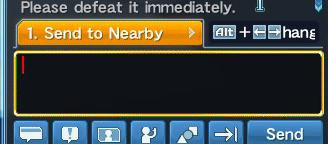 
    Hoặc chat nhanh bằng việc đặt command sau lên trước câu:
    - `/a` : Public Chat
    - `/p` : Party Chat
    - `/t` : Team Chat
- Phím `Scroll Lock` để bật chat mode, gõ phím bất kì sẽ bắt đầu chat luôn, thích hợp dùng khi AFK tại Lobby.

## 2: Text Color
## ( Màu Chữ )
Thay đổi màu chữ bằng việc thêm `{màu}` vào trước đó
`{màu}` có dạng `{3 chữ cái đầu tiên của màu đó trong t.anh}`. VD: `{red}` : màu đỏ, `{blu}` : xanh nước biển,...

Command | Màu
------- | --------------------- 
{red}   | red - đỏ
{ora}   | orange - cam
{yel}   | yellow - vàng
{gre}   | green - xanh lá 
{blu}   | blue - xanh nước biển
{pur}   | purple - tím
{vio}   | pink - hồng
{bei}   | beige - xám tro 
{whi}   | white - trắng
{blk}   | black - đen
{def}   | bỏ màu trước đó

Có thể dùng nhiều lệnh màu trong câu.  VD:  `chu binh thương {red} qua mau do {vio} chuyen mau hong {def} ve mau mac dinh` .  

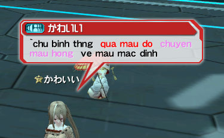

## 3: Chat Bubble
## ( Bong Bóng Thoại ) 

- `/toge` : biểu thị mấy thoại cần hét lớn 

- `/moya` : biểu thị suy nghĩ thoại

- `/mn#` : # là số từ 1~39. Bong bóng thoại cảm xúc.

VD: `/mn1`, `/mn2`, ..., `/mn39`

## 4: Lobby Actions
Mỗi [LA](thuat_ngu.html#la) đều có 2 dáng cho 2 giới tính. 

- `/fla <command>` để xem LA cho nữ
- `/mla <command>` để xem LA cho nam

Ngoài ra dùng
- `/la <command>` để xem LA cho giới tính của char, đây sẽ là preview mặc định khi nghía LA trên visi. VD char nữ thì dùng sẽ ra LA cho nữ
- `/cla <command>` để coi LA trái ngược với giới tính của char. VD char nữ thì dùng sẽ ra LA cho nam và ngược lại

với `<command>` là tên command của LA

`/la la_sit1` | `/cla cla_sit1 `
-- | --
 | 

## 5: Cut-in Display
Bạn có thể hiển thị mặt của char cho mọi người xem kèm các câu thoại.

- Cấu trúc: `/ci<kiểu> <hướng> <tuỳ chọn>`

- Trong đó:

Kiểu biểu cảm khuôn mặt| Hướng quay camera | Tuỳ chọn
-- | -- | --
`1` : biểu cảm bình thường | `1`: phía trước | `nw` : không hiển thị khung cut-in (như chat bình thường )
`2` : vui | `2` : chéo | `s#` : Thời gian hiện cut-in.   `#` thay bằng số giây. VD: `s15`, `s30`.
`3` : tức giận | `3` : chéo trên | `t#` : độ sáng, thay   `#` bằng số từ 1~5. VD `t1`, `t2`, ..., `t5`.
`4` : buồn | `4` : chéo dướI | 	
`5` : ngạc nhiên | `5` : cạnh bên | 
`6` : nhắm mắt |  | 
`7` : ngậm miệng |  | 
`8` : vui 2 | | 
`9` : nháy mắt |  | 

VD: 

`/ci3 3 test` | `/ci9 1 t4 test`
--- | ---
 | 

## 6: Symbol Art

Sau khi lưu [SA](thuat_ngu.html#sa) thì bạn có thể dùng nó bằng cách gõ `/symbol<số SA>`

 

VD: `/symbol6`

 

## 7: Voice
Dùng command `/vo<số>` để nghe các thoại của voice đó. 

Lưu ý: mở loa lên.

Command | Thoại
-- | --
`/vo1` | S-ATK Voice Clips
`/vo2` | R-ATK Voice Clips
`/vo3` | Forward Aiming Technics
`/vo4` | AoE / Recovery Technics
`/vo5` | Minor Damage
`/vo6` | Large Damage
`/vo7` | Upon Revival
`/vo8` | Incapacitated
`/vo9` | Photon Blast
`/vo10` | Special Action
`/vo11` | Charged Attack
`/vo12` | SEGA! (Không phải voice nào cũng có)
`/vo13` ~ `/vo20` | Thoại đặc biệt. 

## 8: Fashion / Selfie 
Fashion / Selfie Command | Short Command | Nội Dung
-- | -- | --
`/costume <costume>` | `/cs <costume>` | Thay đổi costume/[OU] có sẵn trong túi.  Lưu ý tên costume phải viết liền.   VD: costume `Off Shoulder Knit Mysterious [Ou]` thì dùng `/cs OffShoulderKnitMysterious[Ou]`
`/camouflage <camo>` | `/cmf <camo>` | Thay đổi camo có sẵn trong túi.  Lưu ý tên camo phải viết liền.     VD: costume `Off Shoulder Knit Mysterious [Ou]` thì dùng `/cs OffShoulderKnitMysterious[Ou]`
`/myfashion#` | `/mf#` | `#` là số từ 1 ~ 10, nếu bạn là Pre User thi `#` chạy từ 1 ~ 30.  Sau khi lưu lại điều chỉnh về thời trang của char (cos, access,...) trong  *Esc > Fashion / Catalog > Fashion Editing > My Fashion* thì chỉ việc gõ `/ms#` để dùng lại fashion đó.   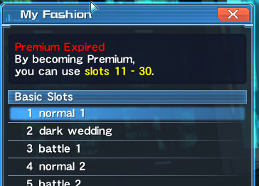
`/ce on`   hoặc    `/ce off` | | Lệnh char nhìn/không nhìn thẳng vào camera 
`/ce# on`   hoặc   `/ce# off` | | Lệnh char nhìn thẳng vào camera với biểu cảm.   `#` là số từ 1~9, xem mục [Cut-in Display](chat_commands.html#5-cut-in-display)
`/ceall` | | Tất cả char sẽ nhìn vào camera trong 10s
`/ce` | | Lệnh char nhìn thẳng vào camera trong 10s
`/ce#` | | Lệnh char nhìn thẳng vào camera với biểu cảm trong 10s. `#` là số từ 1~9
`/ce# stop` | | Đóng băng biếu cảm nhân vật. `#` là số từ 1~9.   VD: dùng `/ce3` chờ chạy tới biểu cảm ưng ý thì `/ce3 stop`
`/la <name> s#` | | Đóng băng LA. Yêu cầu Pre User.  `<name>` là LA, `#` là giây.   VD: `/la trance s3.9`
`/uioff #` | | Ẩn UI game. `#` nếu bỏ trống thì mặc định là 10s, tối đa là 600s. Bật lại UI bằng cách ấn Esc

## 9: Status
## ( Trạng Thái )
Command | Short Command | Nội Dung
-- | -- | --
`<hp>` | | HP hiện tại / max HP
`<pp>` | | PP hiện tại / max PP
`<photonarts>`| `<pa>` | Tên của PA sử dụng lần cuối
`<technic>`| `<tc>` | Tên của Techni sử dụng lần cuối
`<skill>` | `<sk>` | Tên của Skill sử dụng lần cuối
`<target>`| `<t>` | Tên của mục tiêu lần cuối nhắm tới
`<et1>`, `<et2>`, `<et3>` | | Tên của các [EC] hiện tại đang gặp
`<pos>` | | Toạ độ hiện tại của char
`<area>` | `<ar>` | Tên của area hiện tại
`<me>` | | Tên char của bạn
`<class>` | `<cl>` | (Mainclass) Lv.(Mainclass level) / (Subclass) Lv.(Subclass level)
`<weapon>` | `<wp>` | Tên của weap đang dùng + grind level
`<basecolor>` | `<bc>` | Màu của base gần nhất, trong EQ TD
`<putitem>` | `<pi>` | tên của item rớt cuối cùng
`<getitem>` | `<gi>` | Tên của item nhặt lên cuối cùng
`<pet>` | | Tên của Pet đang dùng
`<darkblast>` | `<db>` | Darkblast đang dùng

Có thể kết hợp với [Bong Bóng Thoại](chat_commands.html#3-bong-bóng-thoại) và [Cut-in Display](chat_commands.html#5-cut-in-display) để kêu gọi những người khác trong cùng area.
VD: 
- `/a /toge /ci1 2 <et1> at <pos>` khi gặp EC

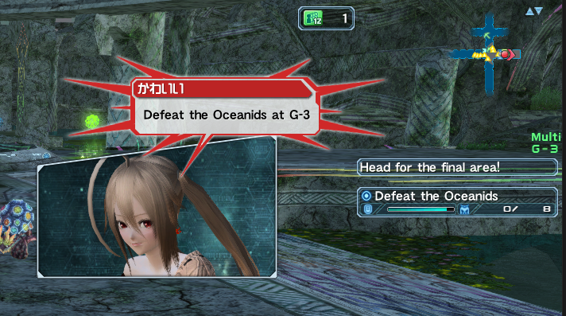 

- `/a /toge <t> at <pos>` khi gặp boss

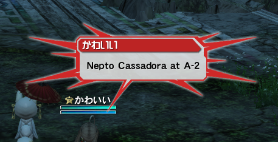 

 

Thay đổi trang bị | Short Command | Nội Dung
-- | -- | --
`/mainpalette#` | `/mpal#` | Đổi Main palette. `#` là số từ 1 ~ 6. VD: `/mpal4`
`/subpalette#` | `/spal#` | Đổi Sub palette. `#` là số từ 1 ~ 6. Nếu bạn cà thẻ để có thêm Sub palette thì `#` có thể chạy từ 1 ~ 18. VD: `/spal2`
`/myset#` | `/ms#` | `#` là số từ 1~18. Sau khi lưu lại điềU chỉnh class, cách xếp PA/Techni của mÌnh tại Class counter > Myset thì chỉ việc gõ `/ms#` để dùng lại set đó.   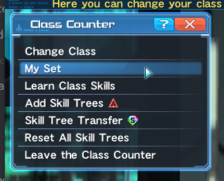
`/skillring <tên ring>` | `/sr <tên ring>` | Đổi ring nhanh. Lưu ý tên ring phải viết liền. VD: `L/Slow Fi Action` thì sẽ là `/sr L/SlowFiAction`

## 10: Other
## ( Khác )

## 11: Note
## ( Lưu ý )
- **Tránh việc spam `/ci` khi đi map, vì cut-in sẽ choáng nhiều không gian hiển thị. `/symbol` ([SA](chat_commands.html#6-symbol-art)) cũng vậy.**

VD như này, thêm ng nữa cut-in là khỏi nhìn

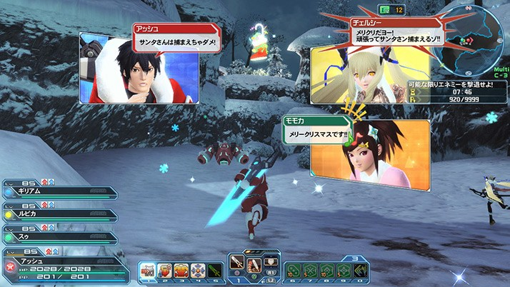

- Có thể để command vào Autoword để tự xài khi gặp các điềU kiện nhất đỊnh

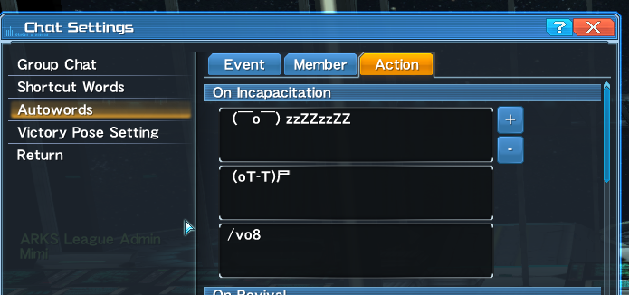 

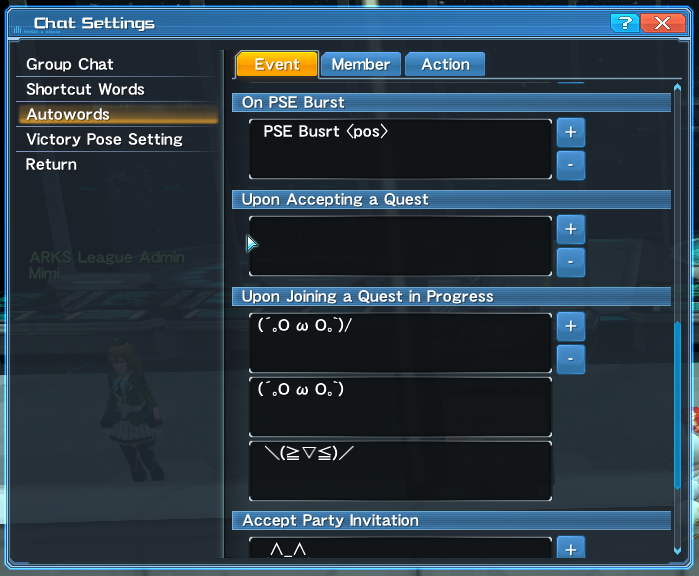 

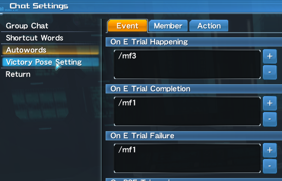 

- Có thể để command vào Shortcut Words

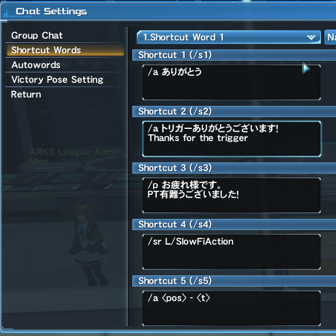 

- Những command yêu cầu tên của item phải viết liền, có thể thay " " bằng "-". 
 VD: `L/Slow Fi Action` thành `L/SlowFiAction` hoặc `L/Slow-Fi-Action`

 
=====================================================

Source: 

- http://ohpso2.wikia.com/wiki/Chat_Commands
- http://pso2.swiki.jp