# Story

Mục Lục:
1. [Note](https://github.com/3ktan/Pso2-s-Compendium/blob/master/compendium/other/story.md#note)
2. [Ep1 ~ Ep3](https://github.com/3ktan/Pso2-s-Compendium/blob/master/compendium/other/story.md#ep1--ep3)
    * [rush story](https://github.com/3ktan/Pso2-s-Compendium/blob/master/compendium/other/story.md#rush-story)
3. [Ep4](https://github.com/3ktan/Pso2-s-Compendium/blob/master/compendium/other/story.md#ep4)
   * [Note Ep4](https://github.com/3ktan/Pso2-s-Compendium/blob/master/compendium/other/story.md#note-ep4)
4. [Ep5](https://github.com/3ktan/Pso2-s-Compendium/blob/master/compendium/other/story.md#ep5)
   * [Note Ep5](https://github.com/3ktan/Pso2-s-Compendium/blob/master/compendium/other/story.md#note-ep5)

#### Note:
1. Có thể Chọn story Ep1-3 hoặc Ep4-5 ở màn hình chọn char

2. Nên clear story ở mode **Normal**, tuy oánh hơi mệt nhưng sẽ có reward xứng đáng sai khi clear, và cả title nữa.
3. Nên clear toàn bộ các node của story, 1 phần vì reward, còn lại là title, hoặc nếu rảnh quá éo có gì làm =))))

#### Ep1 ~ Ep3
3 Ep này story theo dạng Matter Board (MB)

Có 2 loại node, màu xanh và vàng:
* Node màu xanh, không quan trọng lắm, tùy trường hợp có thể bỏ
* Node màu vàng là main story, cái này không thẻ bỏ qua nếu muốn đi tiếp

Mỗi node sẽ có 2 kiểu:
* Kiếm item - yêu cầu bem con quái nào đó và rớt ra đồ cần kiếm

_Yêu cầu bem Oodan để kiếm Gunslayer_
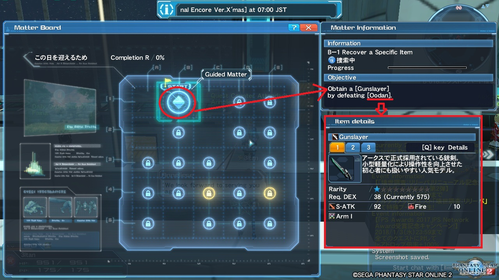

_Gunslayer sau khi drop_
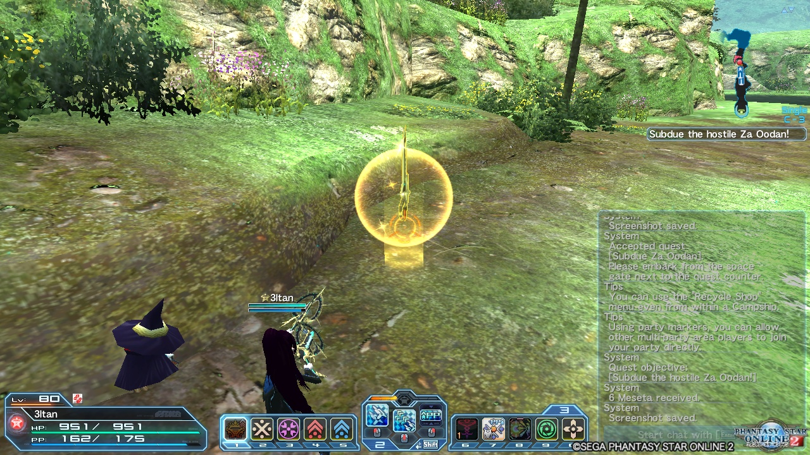

* Kiểu Event Field (EF) - xem 1 đoạn movie nho nhỏ (esc > enter thẳng tiến)

_Yêu cầu chạy loanh quanh map kiếm EF và xem nó_
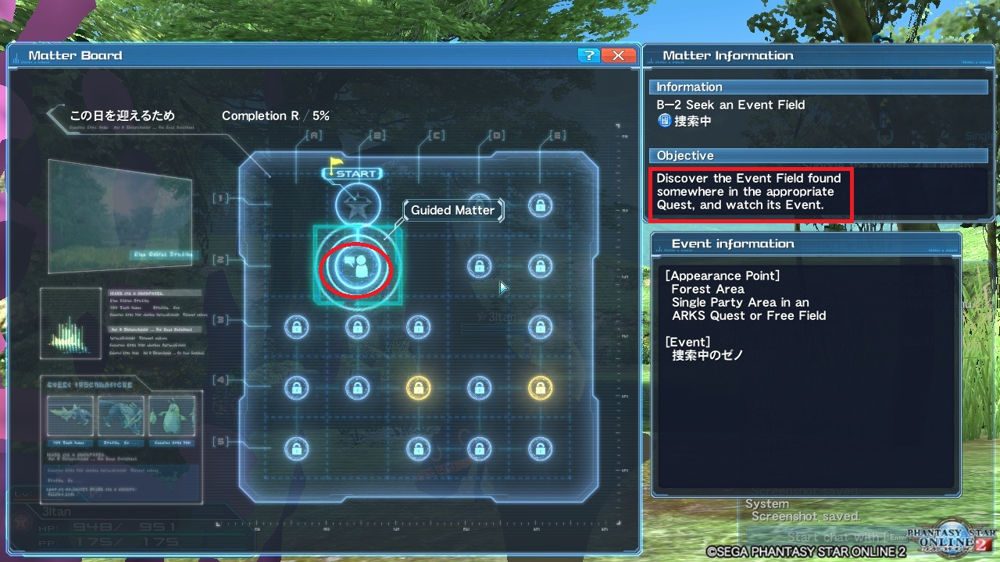

_EF cần kiếm sẽ có **màu vàng**, không phải màu xanh (xanh là EF chưa coi hoặc nó là side story), cũng không phải xám (xám là EF đã coi)_
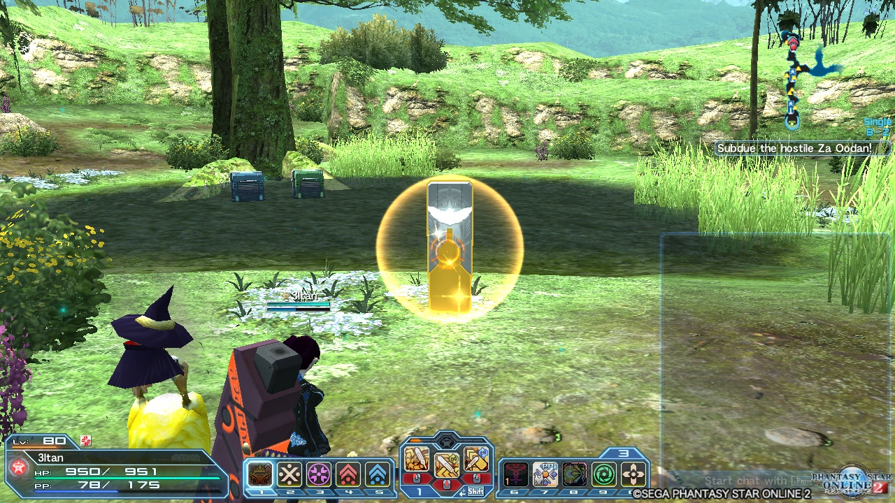

_Hoặc có thể yêu cầu đi kiếm NPC_
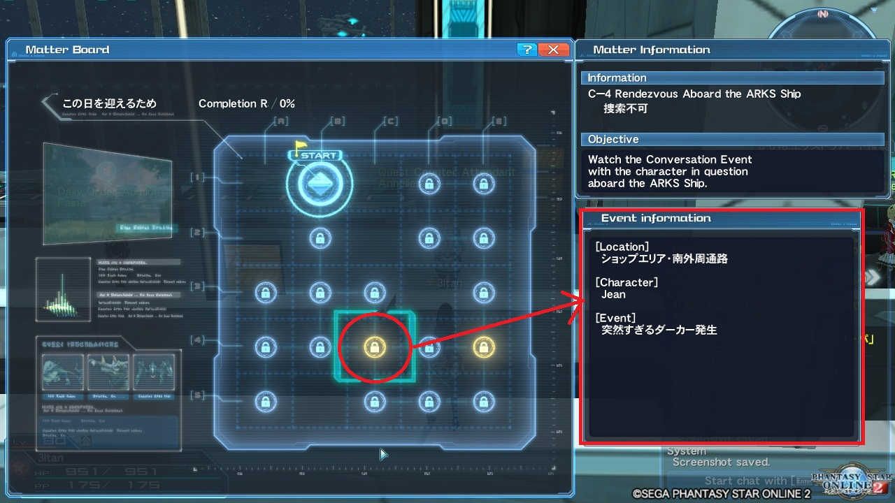

Map nào có xuất hiện mob/boss hay EF sẽ có ký hiệu như này, NPC cũng tương tự (có kí hiệu đó trên đầu):

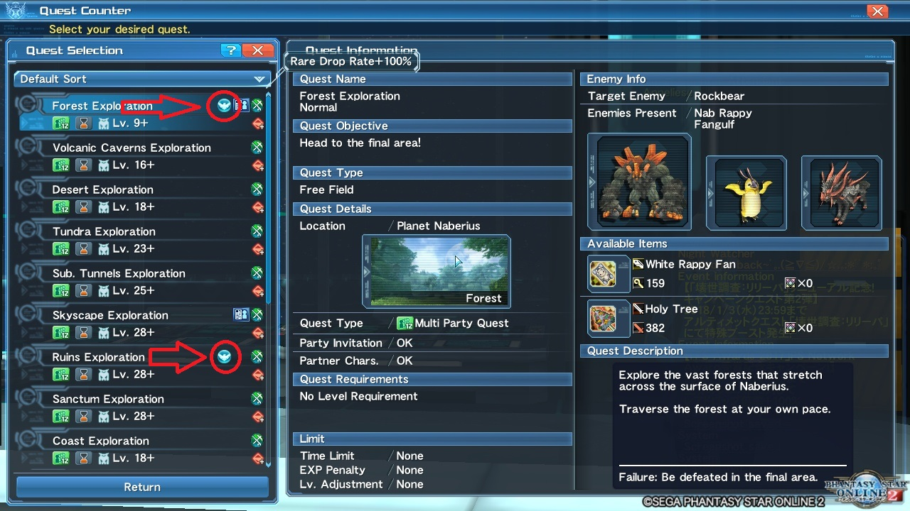

**Khuyến cáo chạy story kiểu event field thì chui vô ARKS Quest mà làm, đừng làm ở Free Field, nếu không muốn rush tận a3 và hấp xong con boss**

#### Rush story
MB nào cũng có title, cho việc hoàn thành mạch chính và hoàn thành toàn bộ (chạy story kiếm title để lấy unit 12* thì cũng nhanh đó)

Nếu lười thì chạy hết node màu vàng (đường màu đỏ) và bỏ qua các node còn lại (gạch chéo màu xanh). 

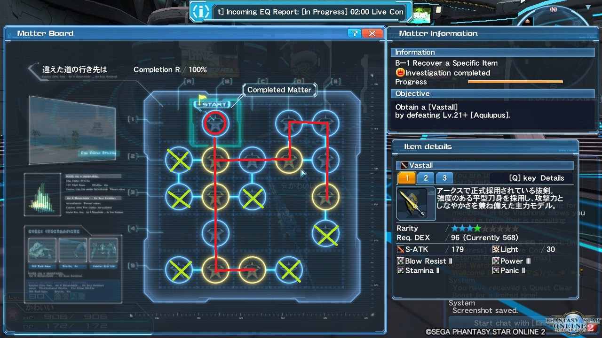

Sau khi hoàn thành lượng node màu vàng nhất định của MB, sẽ có thông báo mở Story Quest. Cứ thế mà chạy thôi rồi làm MB tiếp.

Trung bình 1 MB sẽ chạy ít nhất 2 lần Story Quest. Lý do? Vì 1 Story Quest sẽ có nhiều hơn 1 lựa chọn (tưởng tượng gal game đi) Đi lần đầu để làm route 1, đi lần 2 làm route 2,..... 

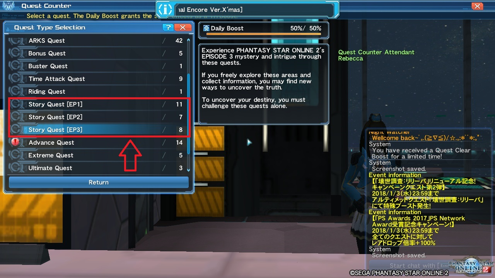

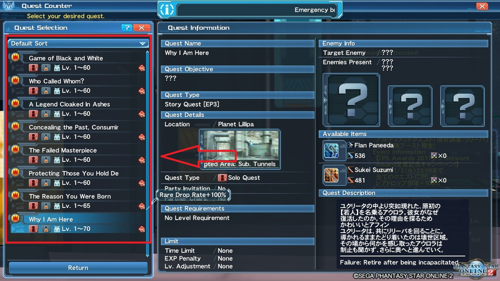

`Công nhận ngày xưa mình chăm chạy story vl................`

#### Ep4
Để chuyển qua mode Ep4, vô Bidge gặp Xiera > Change To Ep4 Mode

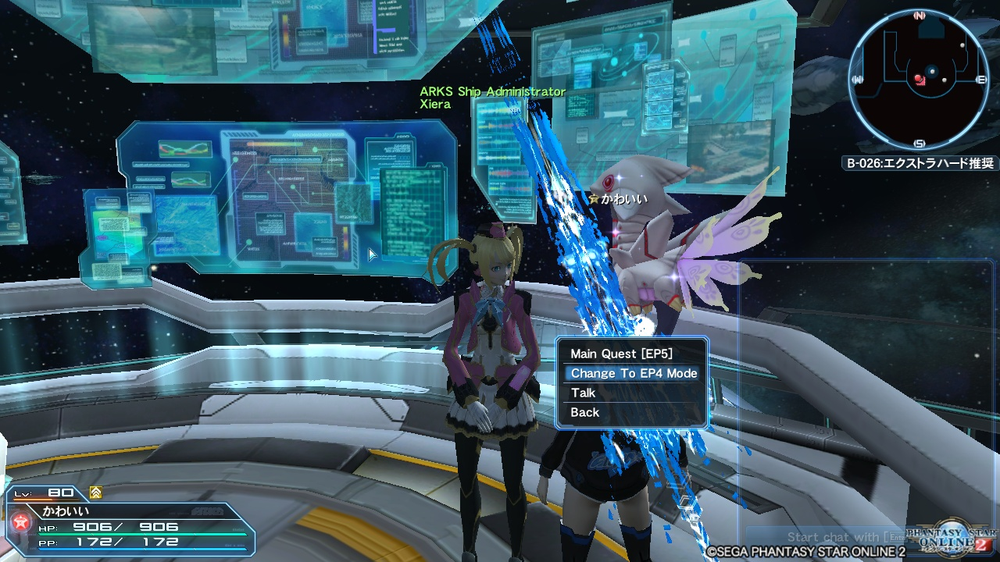

Ep4 thì có tiến bộ hơn tí, giao diện khá đơn giản. MB ở dạng cây, và phân nhánh ra.
Đường màu đỏ là main story. Cứ theo nó mà làm, có cái gì rẽ nhánh khỏi đường này thì có thể bỏ qua.

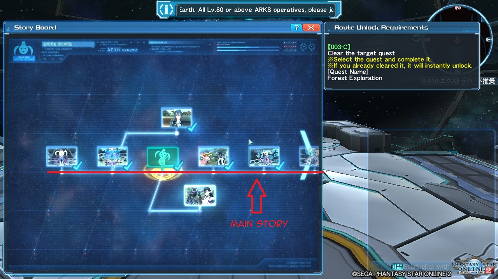

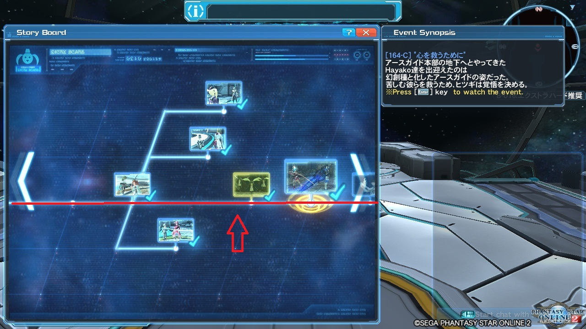

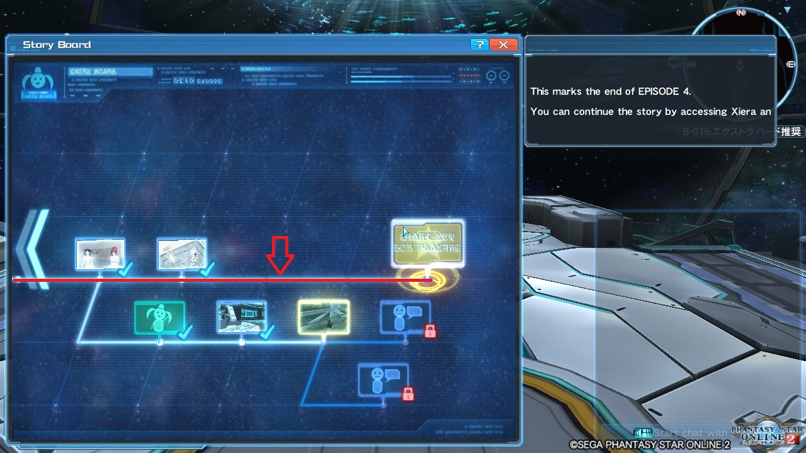

#### Note ep4:
* Từ Ep4 trở đi khi chạy Story Quest, boost sẽ tự động pause
* Story Ep4 hơi tù, phải vào Bridge mới có thể làm, không như Ep1-3
* ơ mợ, định viết gì quên r.......

#### Ep5
Để chuyển qua mode Ep4, vô Bidge gặp Xiera > Change To Ep4 Mode

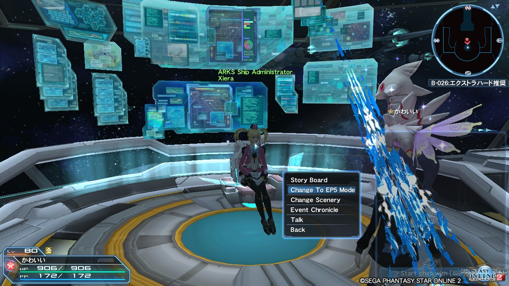

Lên ep5 thay đổi giao diện MB, lần này ở dạng Quest, cũng chả khác là bao, nó hiện ra cái gì thì chạy cái đó. 

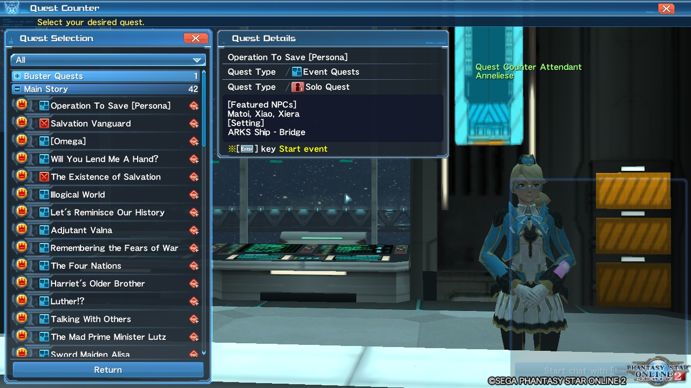

Có mấy cái Quest BUQ yêu cầu đi MPA, nhưng không có MPA nào đi thì bỏ xó cho mốc meo cũng được. Tạm thời chưa thấy ảnh hưởng gì :thinking: 

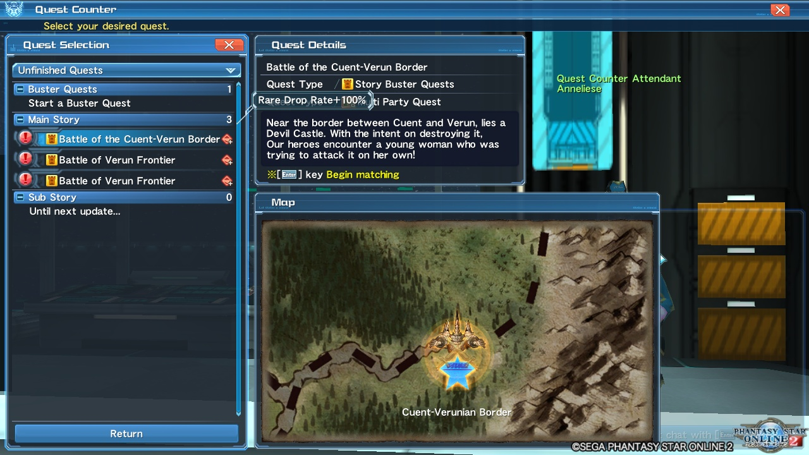

Ep5 đánh dấu sự xuất hiện của [Dark Blast](https://3ktan.wordpress.com/2017/10/16/pso2_dark-blast/)

Muốn có DB thì clear Ep5 Chap 2 (The End Of The Conflict, hình như là cái này, hình dưới) hoặc clear BEQ: Endless Belligerence

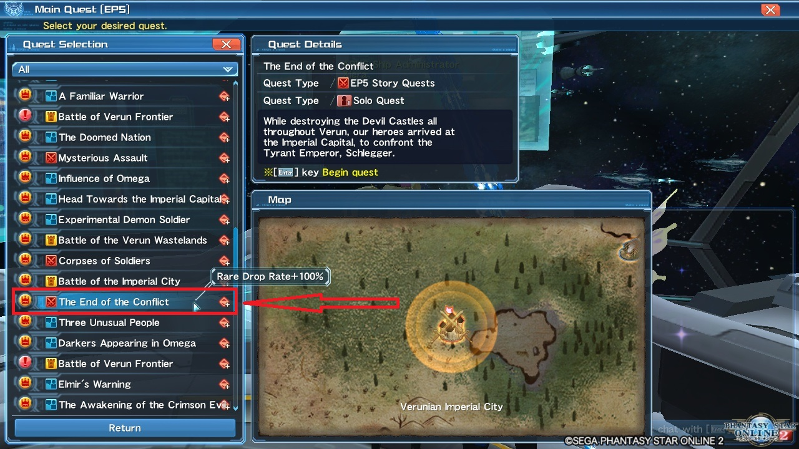

Ngoài ra Ep5 cập nhật thêm Omnibus Quest. Quest này tóm tắt lại và thêm 1 số cảnh của story ep 1 ~ 3

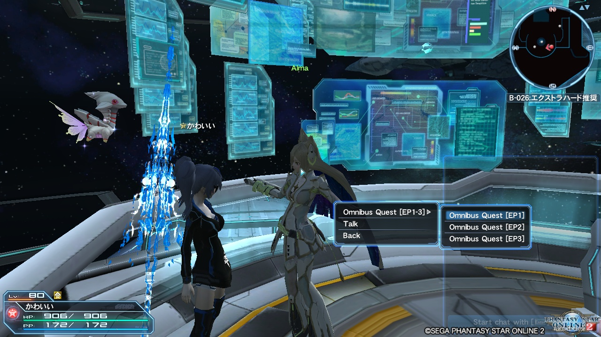

Nếu lười làm MB ep 1-3 thì có thể làm cái này thay.

#### Note ep5:
* Có thể làm story ngay ở lobby, đỡ tù hơn ep4
* Nếu không đi BEQ được thì nên làm story ep5 để kiếm Dark Blast
