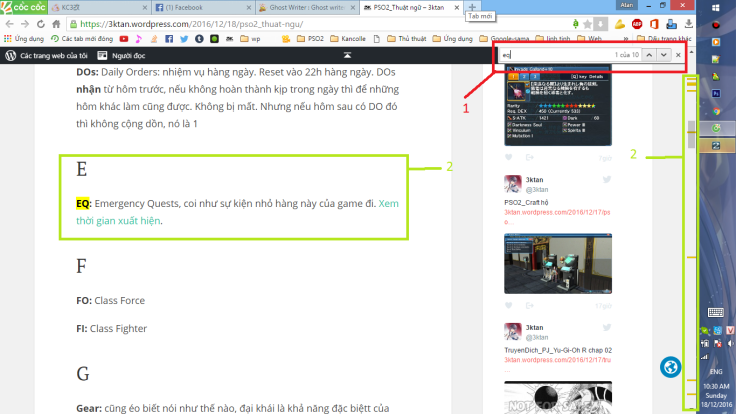
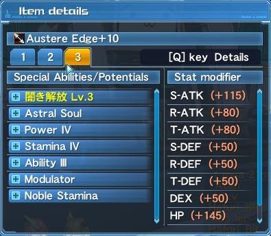
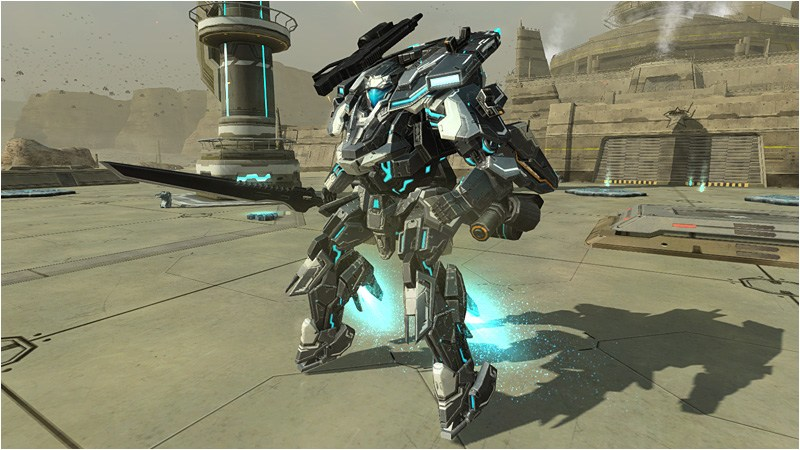
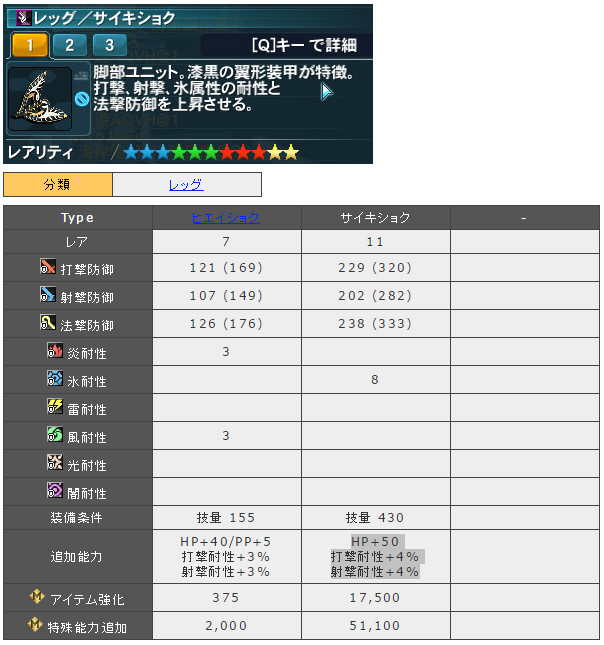
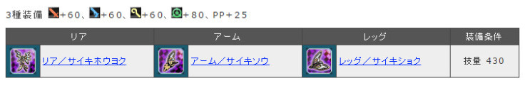
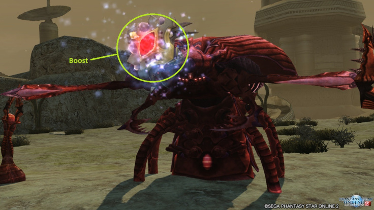
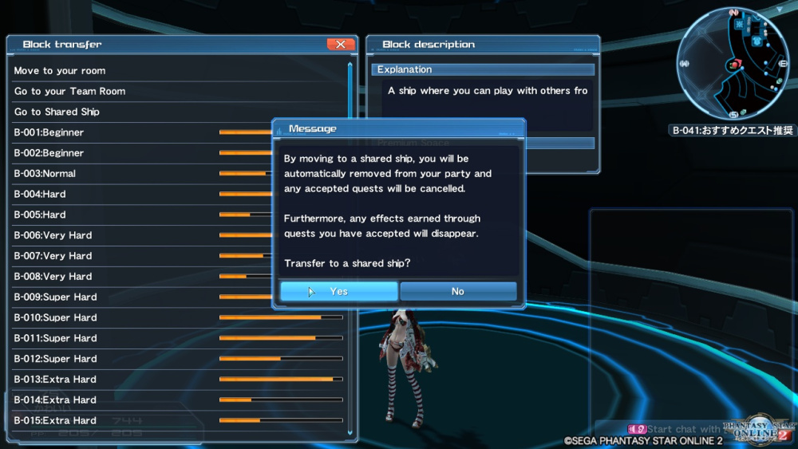
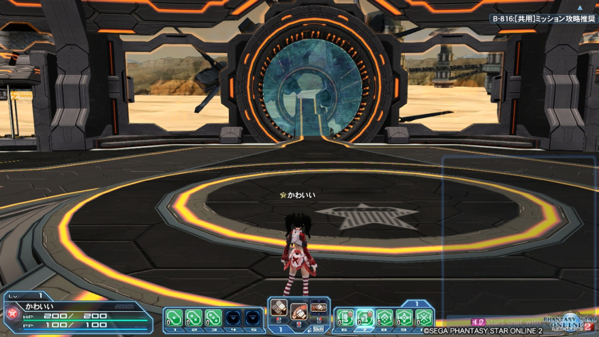

# PSO2_Thuật ngữ

Thuật ngữ, viết tắt, cách gọi trong game……
Cách tìm nhanh, ấn F3 hoặc Ctrl + F, sẽ xuất hiện thanh tìm kiếm (1), gõ thuật ngữ vào, nó sẽ nhảy đến vị trí thuật ngữ đó, VD eq (2), ấn mũi tên lên xuống bên cạnh để nhảy đến chỗ cần tìm trong trường hợp có nhiều kết quả quá.

Ngoài ra một số tên khác có thể viết tắt bằng 3,4 chữ đầu như: shoot III : sho3, technique III: tech3, catalyst: cata, tùy vào cách m.ng gọi trong game, viết cho nhanh (sẽ không đề cập bên dưới)

1 | 2 | 3 | 4 | 5 | 6
-- | -- | -- | -- | -- | --
[A](https://github.com/3ktan/Pso2-s-Compendium/blob/master/compendium/thuat_ngu.md#a) | [B](https://github.com/3ktan/Pso2-s-Compendium/blob/master/compendium/thuat_ngu.md#b) | [C](https://github.com/3ktan/Pso2-s-Compendium/blob/master/compendium/thuat_ngu.md#c) | [D](https://github.com/3ktan/Pso2-s-Compendium/blob/master/compendium/thuat_ngu.md#d) | [E](https://github.com/3ktan/Pso2-s-Compendium/blob/master/compendium/thuat_ngu.md#e) | [F](https://github.com/3ktan/Pso2-s-Compendium/blob/master/compendium/thuat_ngu.md#f)
[G](https://github.com/3ktan/Pso2-s-Compendium/blob/master/compendium/thuat_ngu.md#g) | [H](https://github.com/3ktan/Pso2-s-Compendium/blob/master/compendium/thuat_ngu.md#h) | [I](https://github.com/3ktan/Pso2-s-Compendium/blob/master/compendium/thuat_ngu.md#i) | [J](https://github.com/3ktan/Pso2-s-Compendium/blob/master/compendium/thuat_ngu.md#j) | [K](https://github.com/3ktan/Pso2-s-Compendium/blob/master/compendium/thuat_ngu.md#k) | [L](https://github.com/3ktan/Pso2-s-Compendium/blob/master/compendium/thuat_ngu.md#l)
[M](https://github.com/3ktan/Pso2-s-Compendium/blob/master/compendium/thuat_ngu.md#m) | [N](https://github.com/3ktan/Pso2-s-Compendium/blob/master/compendium/thuat_ngu.md#n) | [O](https://github.com/3ktan/Pso2-s-Compendium/blob/master/compendium/thuat_ngu.md#o) | [P](https://github.com/3ktan/Pso2-s-Compendium/blob/master/compendium/thuat_ngu.md#p) | [Q](https://github.com/3ktan/Pso2-s-Compendium/blob/master/compendium/thuat_ngu.md#q) | [R](https://github.com/3ktan/Pso2-s-Compendium/blob/master/compendium/thuat_ngu.md#r)
[S](https://github.com/3ktan/Pso2-s-Compendium/blob/master/compendium/thuat_ngu.md#s) | [T](https://github.com/3ktan/Pso2-s-Compendium/blob/master/compendium/thuat_ngu.md#t) | [U](https://github.com/3ktan/Pso2-s-Compendium/blob/master/compendium/thuat_ngu.md#u) | [V](https://github.com/3ktan/Pso2-s-Compendium/blob/master/compendium/thuat_ngu.md#v) | [W](https://github.com/3ktan/Pso2-s-Compendium/blob/master/compendium/thuat_ngu.md#w) | [X](https://github.com/3ktan/Pso2-s-Compendium/blob/master/compendium/thuat_ngu.md#x)
[Y](https://github.com/3ktan/Pso2-s-Compendium/blob/master/compendium/thuat_ngu.md#y) | [Z](https://github.com/3ktan/Pso2-s-Compendium/blob/master/compendium/thuat_ngu.md#z) | [# Khác](https://github.com/3ktan/Pso2-s-Compendium/blob/master/compendium/thuat_ngu.md#-kh%C3%A1c) | -- | -- | --

## A
#### **ATM:** 
Automate, Trong Skill Tree của HU, tự động xài mate khi HP<50%

#### **AQ:** 
Adventure Quest: [PSO2 – AQ, Red / Blue Weap](https://3ktan.wordpress.com/2016/07/10/pso2-red-blue-weap/)

#### **Affix:** 
~~(bên SEA gọi là aug)~~ tự mình cộng thêm chỉ số cho weap/unit bằng các ability

#### **Abi:** 
Ability, các soul, atk đặc biệt để affix vô weap/unit

#### **AC:**
ARKS Cash, 1 AC = 1 Yên Nhật, nạp tiền vô game thì đơn vị nó là AC đó

#### **AQ:**
[Adventure Quest](https://3ktan.wordpress.com/2016/07/10/pso2-red-blue-weap/#1): Q để cày lvl hoặc đồ đem bán

#### **A.I.S**
AIS: Arks Interception Silhouette. Nguyên con robot mà mình có thể xài. Chức năng thì khá đơn giản nhưng dmg to thì khỏi bàn

#### **Advence Classes:**
Class nâng cao, bá từ khả năng sống sót tới dealt dmg (ep5 đổ đi): HR (Hero)

Segay sẽ còn update thêm class dạng này trong tương lai. Broken game af

#### **Abnormal:** 
bao gồm mob/boss UQ, mobe boss Xh+ / lvl 80+ (chưa chắc lắm), boss Profound Darkness. 

Abi Ultimate Buster (UB) tăng 10% dmg khi bem abnormal. Chỉ affix dược cho weap < 13* và rate = 100% với 5 fodder có UB: [Link affix](http://pso2affix.seilent.net/#!/s=VH01&1=VH01&2=VH01&3=VH01&4=VH01&5=&r=VH01&o=)

## B
#### **BO:** 
Class Bouncher

#### **BR:** 
Class Braver, bên sea là Samurai

#### **Bonus unit – Hiden Effect**
(cá nhân hay gọi là bonus unit):  chỉ số cộng thêm của 1 unit, không xem được, muốn xem phải tự tính khi trang bị vào người
Như trong hình thì cái Leg Saiki này có bonus unit là +50hp và 2 cái resis
=> khi trang bị cái leg này hp +50, không tính affix

#### **Bonus unit – Set Effect** 
(cá nhân hay gọi là bonus set): chỉ số cộng thêm khi trang bị đủ unit/weap trong 1 bộ
Như trong hình thì phải trang bị đủ Rear, Arm, Leg / Saiki thì mới được cộng 60 S/R/T atk, 80 Dex, 25 pp

#### **B:**
Block, VD b205 = block 205

#### **Boost enemys, Boost Boss, Boost mob:**
Mấy con quái có cục màu đỏ (N, H, VH) hoặc trắng (SH+) ở đâu dó trên cơ thể, cục boost đó weak ele: Fire/Ice/Lighting. Boost tăng atk, HP quái và exp mình nhận thêm. Boost càng to thì quái càng khỏe (ảnh dưới là 1 VD)

#### **BQ:**
[Bonus Quest](https://3ktan.wordpress.com/2016/07/05/pso2_co-ban-cho-nguoi-moi-ver-2/#1.3): Q chủ yếu để hack lvl và đồ đạc cho newbie

#### **BuQ:**
Buster Quest, Quest xuất hiện tại ep5, na ná TD

#### **Base:**
* trong affix thì ám chỉ weap/unit mình affix để sử dụng
* trong EQ TD thì nó chỉ mấy cái trụ mình cần bảo kê

#### **Counter:**
phản dmg (và boost dmg bản thân - nếu + tree) khi chặn đứng 1 đòn đánh từ đối phương, chỉ áp dụng với katana. (xài shift (2 button) hoặc weap actione (3 button) để counter) [Xem thêm](https://3ktan.wordpress.com/br/)

#### **Craft:**
xem thêm: [Pso2 – Craft Items + NPC Zieg](https://3ktan.wordpress.com/2016/07/01/pso2-npc-zieg-craft-items/) và [PSO2_Craft hộ](https://3ktan.wordpress.com/2016/12/17/pso2_craft-ho/) và [PSO2_Craft Type 0](https://3ktan.wordpress.com/2016/11/05/pso2_craft-type-0/)

#### **COs:**
Client Orders, các nhiệm vụ từ các npc khác nhau

#### **CC:**
Casino Coin, tiền để chơi mấy trò trong Casino như: Rappy Slot, Mesetan Shooter,…

#### **CM:**
Challenge Mile, đơn vị tiền kiếm được khi đi **CQ: Challenge Quest**
**Đi CQ:** Đầu tiên qua share ship (Go to Share Ship > Yes  > Yes). ~~Nếu đi team thì chỉ cần qua B501. 502 là được~~ CQ giống như kiểu survival game. Bem quái, kiếm items, weap, rồi tiếp tục bem quái. Qua hết các màn (mision) trong thời gian quy định (VR) là xong. Khá hay, luyện kĩ năng tốt. Lưu ý là khi qua shared ship thì 1 số chức năng sẽ bị hạn chế, như team (team commands, team chat), char coi như mới tạo, ếu có cái vẹo gì cả. May là còn thay cos được

CQ | CQ | CQ 
-- | -- | --
 |  | 

## C

## D

## E

## F

## G

## H

## I

## J

## K

## L

## M

## N

## O

## P

## Q

## R

## S

## T

## U

## V

## W

## X

## Y

## Z

## # Khác

