# PSO2_Thuật Ngữ

[Trang chủ](https://github.com/3ktan/Pso2-s-Compendium)

lick gốc [PSO2_Thuật ngữ](https://3ktan.wordpress.com/2016/12/18/pso2_thuat-ngu/)

Thuật ngữ, viết tắt, cách gọi trong game……

Cách tìm nhanh, ấn F3 hoặc Ctrl + F, sẽ xuất hiện thanh tìm kiếm (1), gõ thuật ngữ vào, nó sẽ nhảy đến vị trí thuật ngữ đó, VD eq (2), ấn mũi tên lên xuống bên cạnh để nhảy đến chỗ cần tìm trong trường hợp có nhiều kết quả quá.

Ngoài ra một số tên khác có thể viết tắt bằng 3,4 chữ đầu như: shoot III : sho3, technique III: tech3, catalyst: cata, tùy vào cách m.ng gọi trong game, viết cho nhanh (sẽ không đề cập bên dưới)

1 | 2 | 3 | 4 | 5 | 6
-- | -- | -- | -- | -- | --
[A](thuat_ngu.md#a) | [B](thuat_ngu.md#b) | [C](thuat_ngu.md#c) | [D](thuat_ngu.md#d) | [E](thuat_ngu.md#e) | [F](thuat_ngu.md#f)
[G](thuat_ngu.md#g) | [H](thuat_ngu.md#h) | [I](thuat_ngu.md#i) | [J](thuat_ngu.md#j) | [K](thuat_ngu.md#k) | [L](thuat_ngu.md#l)
[M](thuat_ngu.md#m) | [N](thuat_ngu.md#n) | [O](thuat_ngu.md#o) | [P](thuat_ngu.md#p) | [Q](thuat_ngu.md#q) | [R](thuat_ngu.md#r)
[S](thuat_ngu.md#s) | [T](thuat_ngu.md#t) | [U](thuat_ngu.md#u) | [V](thuat_ngu.md#v) | [W](thuat_ngu.md#w) | [X](thuat_ngu.md#x)
[Y](thuat_ngu.md#y) | [Z](thuat_ngu.md#z) | [# Khác](thuat_ngu.md#-kh%C3%A1c) | -- | -- | --

## A
#### **ATM:** 
Automate, Trong Skill Tree của HU, tự động xài mate khi HP<50%

#### **AQ:** 
Advence Quest: [PSO2 – AQ, Red / Blue Weap](https://3ktan.wordpress.com/2016/07/10/pso2-red-blue-weap/)

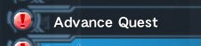

#### **Affix:** 
~~(bên SEA gọi là aug)~~ tự mình cộng thêm chỉ số cho weap/unit bằng các [Ability](thuat_ngu.md#abi)

#### **Abi:** 
Ability, các soul, atk đặc biệt để affix vô weap/unit

#### **AC:**
ARKS Cash, 1 AC = 1 Yên Nhật, nạp tiền vô game thì đơn vị nó là AC đó

#### **AQ:**
[Adventure Quest](https://3ktan.wordpress.com/2016/07/10/pso2-red-blue-weap/#1): Q để cày lvl hoặc đồ đem bán

#### **A.I.S**
AIS: Arks Interception Silhouette. Nguyên con robot mà mình có thể xài. Chức năng thì khá đơn giản nhưng dmg to thì khỏi bàn

#### **Advence Classes:**
Class nâng cao, bá từ khả năng sống sót tới dealt dmg (ep5 đổ đi): HR (Hero)

Segay sẽ còn update thêm class dạng này trong tương lai. Broken game af

#### **Abnormal:** 
bao gồm mob/boss UQ, mobe boss Xh+ / lvl 80+ (chưa chắc lắm), boss Profound Darkness. 

Abi Ultimate Buster (UB) tăng 10% dmg khi bem abnormal. Chỉ affix dược cho weap < 13* và rate = 100% với 5 fodder có UB: [Link affix](http://pso2affix.seilent.net/#!/s=VH01&1=VH01&2=VH01&3=VH01&4=VH01&5=&r=VH01&o=)

#### **Arks Missions**
Phím tắt: Esc > ấn phím Shift hoặc mở theo hình:

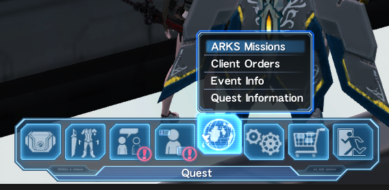

Đây sẽ là những nhiệm vụ kiếm meseta chính hàng tuần. Yêu cầu khá là đơn giản, càng nhiều char thì càng nhiều mes. Reset vào thứ 4 hàng tuần (ngày bảo trì)

## B
#### **BO:** 
Class Bouncher

#### **BR:** 
Class Braver, bên sea là Samurai

#### **Bonus unit – Hiden Effect**
(cá nhân hay gọi là bonus unit):  chỉ số cộng thêm của 1 unit, không xem được, muốn xem phải tự tính khi trang bị vào người
Như trong hình thì cái Leg Saiki này có bonus unit là +50hp và 2 cái resis

=> khi trang bị cái leg này hp +50 và 2 cái resis 4%, không tính affix

#### **Bonus unit – Set Effect** 
(cá nhân hay gọi là bonus set): chỉ số cộng thêm khi trang bị đủ unit/weap trong 1 bộ

Như trong hình thì phải trang bị đủ Rear, Arm, Leg / Saiki thì mới được cộng 60 S/R/T atk, 80 Dex, 25 pp

#### **B:**
Block, VD b205 = block 205

#### **Boost enemys, Boost Boss, Boost mob:**
Mấy con quái có cục màu đỏ (N, H, VH) hoặc trắng (SH+) ở đâu dó trên cơ thể, cục boost đó weak ele: Fire/Ice/Lighting. Boost tăng atk, HP quái và exp mình nhận thêm. Boost càng to thì quái càng khỏe (ảnh dưới là 1 VD)

#### **BQ:**
[Bonus Quest](https://3ktan.wordpress.com/2016/07/05/pso2_co-ban-cho-nguoi-moi-ver-2/#1.3): Q chủ yếu để hack lvl và đồ đạc cho newbie

#### **BuQ:**
Buster Quest, Quest xuất hiện tại ep5, na ná TD

#### **Base:**
* trong affix thì ám chỉ weap/unit mình affix để sử dụng
* trong EQ TD thì nó chỉ mấy cái trụ mình cần bảo kê

## C

#### **Counter:**
phản dmg (và boost dmg bản thân - nếu + tree) khi chặn đứng 1 đòn đánh từ đối phương, chỉ áp dụng với katana. (xài shift (2 button) hoặc weap actione (3 button) để counter) [Xem thêm](https://3ktan.wordpress.com/br/)

#### **Craft:**
xem thêm: [Pso2 – Craft Items + NPC Zieg](https://3ktan.wordpress.com/2016/07/01/pso2-npc-zieg-craft-items/) và [PSO2_Craft hộ](https://3ktan.wordpress.com/2016/12/17/pso2_craft-ho/) và [PSO2_Craft Type 0](https://3ktan.wordpress.com/2016/11/05/pso2_craft-type-0/)

#### **COs:**
Client Orders, các nhiệm vụ từ các npc khác nhau

#### **CC:**
Casino Coin, tiền để chơi mấy trò trong Casino như: Rappy Slot, Mesetan Shooter,…

#### **CM:**
Challenge Mile, đơn vị tiền kiếm được khi đi **CQ: Challenge Quest**
**Đi CQ:** Đầu tiên qua share ship (Go to Share Ship > Yes  > Yes). ~~Nếu đi team thì chỉ cần qua B501. 502 là được~~ CQ giống như kiểu survival game. Bem quái, kiếm items, weap, rồi tiếp tục bem quái. Qua hết các màn (mision) trong thời gian quy định (VR) là xong. Khá hay, luyện kĩ năng tốt. Lưu ý là khi qua shared ship thì 1 số chức năng sẽ bị hạn chế, như team (team commands, team chat), char coi như mới tạo, ếu có cái vẹo gì cả. May là còn thay cos được

CQ | CQ | CQ 
-- | -- | --
 |  | 

#### **Cap:** 
[Capsule a/b/c/d/e/f](https://3ktan.wordpress.com/2016/07/10/pso2-red-blue-weap/#1), vé vào cửa để đi AQ

#### **Cos:**
costum, trang phục (tốn slot bag)

#### **CF / Collect / File Collect:**
ám chỉ việc đi kiếm weap 13*+ NT [Pso2- New Type Weapon – NT weapon](https://3ktan.wordpress.com/2016/06/27/pso2-new-type-weapon-nt-weapon-2/)

#### **Compound:**
Compound Technique. Techni đặc biệt của FO và TE, kết hợp giữa 2 ele. Tất nhiên dmg của nó cũng ảnh hưởng bởi việc build ele nào trong tree (và cả ele của weap nếu main FO). Có thể mua trong photon shop ở F2 shop area với 50 photon sphere / compound. Hoặc làm story ep3, gặp Claris để làm COs

* **Zandion** ザンディオン   kết hợp giữa Wind và Lighting
* **Fomelgion** (fomel) フォメルギオン , kết hợp giữa Fire và Dark (kame…hame…HAA!!!
* **Barantsion** (baran) バーランツィオン , kết hợp giữa Ice và Light
* Ảnh minh họa: (theo thứ tự trên xuống: Zandion, Fomelgion, Barantsion  )

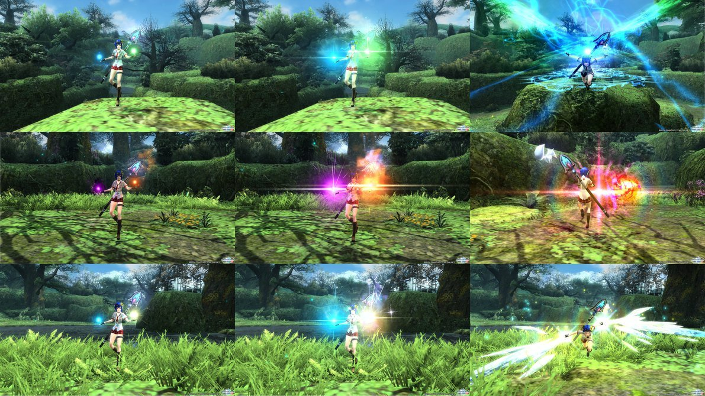

## D
#### **Dmg:**
Damage, sát thương. Dmg mình gây ra màu trắng là dmg thường, còn màu xanh là crit. Tương tự khi bị boss/mob bem, màu đỏ bé là dmg thường, màu đỏ to là crit. Crit sẽ thấy nhiều khi ăn nguyên cái ulti của boss vào người

#### **DOs:**
Daily Orders: nhiệm vụ hàng ngày. Reset vào 22h hàng ngày (theo giờ VN, chứ bên Nhật là 00h rồi). DOs nhận từ hôm trước, nếu không hoàn thành kịp trong ngày thì để những hôm khác làm cũng được. Không bị mất. Nhưng nếu hôm sau có DO đó thì không cộng dồn, nó là 1

#### **DD:**
Darker Den, map đặc biệt. Có tỉ lệ “rớt máy bay” khi đi TA mode VH+. (EQ DD không tính là đặc biệt)

#### **Dark Blast:**
(DB) viết tắt dễ gây hiểu lầm với Duel Blade lắm. Hiểu đơn giản thì nó là AIS xài 1 lần / Quest. Để unlock thì clear ep5 tới đoạn có Dark Blast hoặc đi BuQ SH+ là có.
DB nó ăn khoảng 10% so với exp mà mình nhận được khi chạy Quest. Exp này sẽ dùng để up skill cho nó. Esc > Dark Blast

Dark Blast | Dark Blast 
-- | -- 
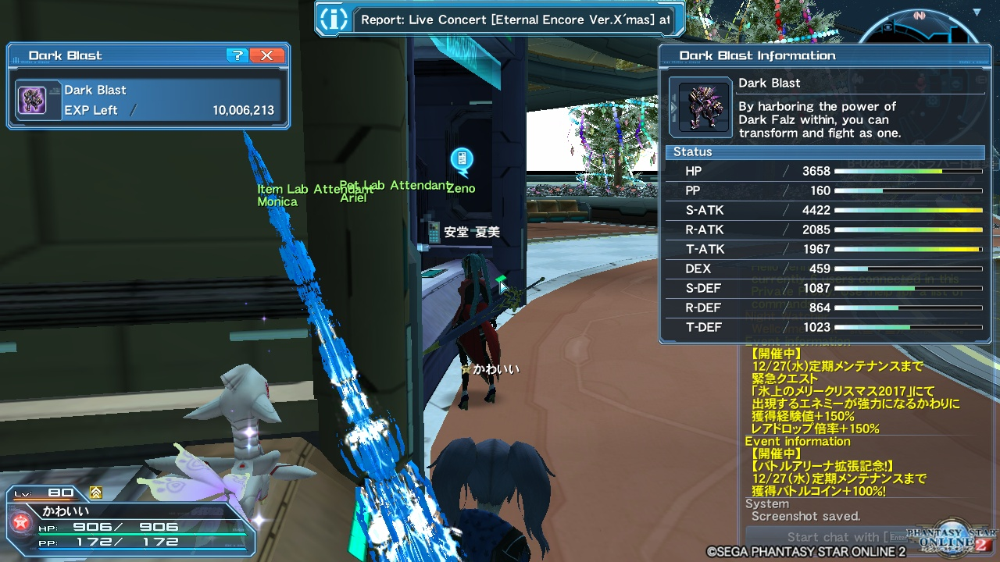 | 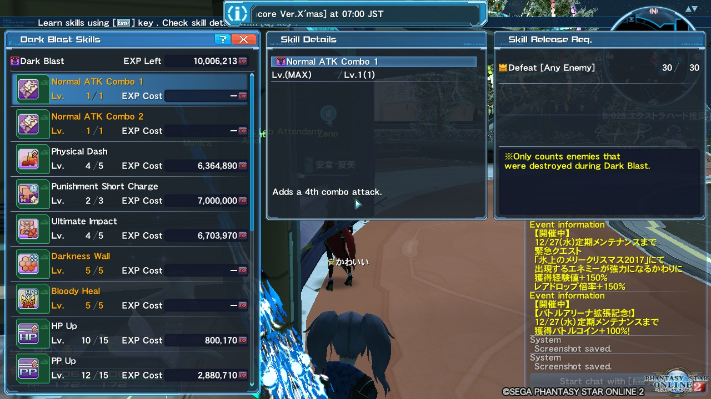

#### **Dragonkin:**
Gọi chung cho mob/boss ở Planet Amdus (map Volca / Sanctum/ Skyscape)

## E
#### **EQ:**
Emergency Quests, coi như sự kiện nhỏ hàng này của game đi. Bên sea là UQ. Có 2 loại EQ, 1 là EQ theo lịch, xem ở [đây](https://calendar.google.com/calendar/embed?src=pso2emgquest@gmail.com&mode=agenda&ctz=Asia/Bangkok). 2 là eq random, cứ bừa phứa có mà không có lịch cụ thể nào, chỉ trước 15′ eq thì nó thông báo ở lobby.

#### **EC:**
Emergency Code, mấy nhiệm vụ nhỏ xuất hiện trong khi đi map

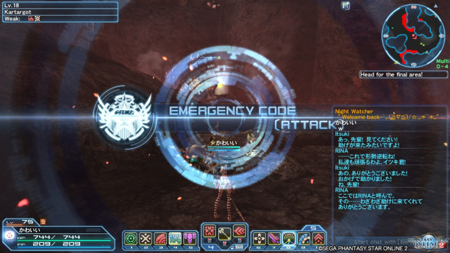

#### **Ele:**
Element: nguyên tố, có 6 loại: Fire / Ice / Light / Wind / Lighting / Dark. Rất quan trọng nếu chơi mấy class liên quan đến ele như FO, TE, BO ele stance

#### **Ex block:**
~~Expert Blocks: block chỉ những ai đã đạt đủ điều kiện mới được vô~~
Giờ nó là [Expert Mode](https://pso2.jp.3ktan.site/post/9-expert-mode)

#### **Evo:**
Evolve Pet Rarity. Dùng để tăng * , change per cho pet mình đang xài tại Pet Lab (shop area, bên cạnh Monica/Dudu)

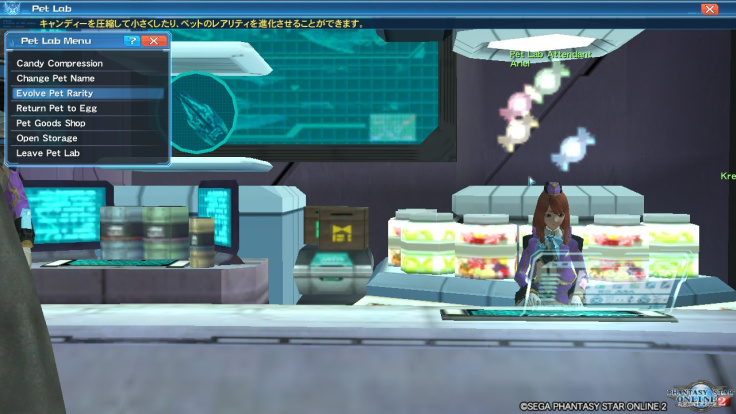

## F
#### **FO:**
Class [Force](https://3ktan.wordpress.com/2017/01/20/pso2_class-fo/)

#### **FI:**
Class Fighter

#### **FQ:**
[Featured Quest](https://3ktan.wordpress.com/2016/07/05/pso2_co-ban-cho-nguoi-moi-ver-2/#1.3), Quest để kiếm Key đi [Bonus Quest](thuat_ngu.md#bq). Reset vào 22h hàng ngày (là 0h theo giờ Nhật)

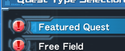

#### **Fodder:**
(trong affix) weap/unit nguyên liệu để mình affix cho weap/unit chính. Affix tối đa được 5 fodder cùng lúc (có thẻ xài 5 weap/unit nguyên liệu để affix cho weap/unit chính), gọi là fodder 1, fodder 2,… fodder 5. Có thể nghịch [web giả lập affix](http://pso2affix.seilent.net/#)

## G
#### **Gear:** 
cũng éo biết nói như thế nào, đại khái là cộng dmg khi xài weap, tùy weap sẽ có gear hoặc không

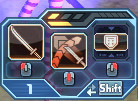 *Gear là cái thanh màu vàng cam trong hình*

#### **Gu:**
Class [Gunner](https://3ktan.wordpress.com/2017/02/15/pso2_class-gu/)

#### **Grind:**
cường hóa vũ khí, tăng chỉ số tấn công (base atk). Qua shop area kiếm Dudu/Monica để tìm hiểu thêm

#### Guard: 
Giảm sát thương nhận vào bằng cách sử dụng Weap Action (WL, sword, pazi, ktn miss counter,…) cơ mà sẽ bị trừ pp

## H
#### HU: 
Class Hunter

#### H: 
Hard Mode: chế độ khó, mob/boss lvl 21+

#### Hidden Pot / pot 2: 
potential ẩn của 1 số weap, cần items đặc biệt để unlock như Photon Booster, Battle Booster… chứ không phải Photon Sphere như bình thường. Pot cũng khá ngon, cơ mà không phải weap nào cũng có

Hidden Pot | Hidden Pot
-- | --
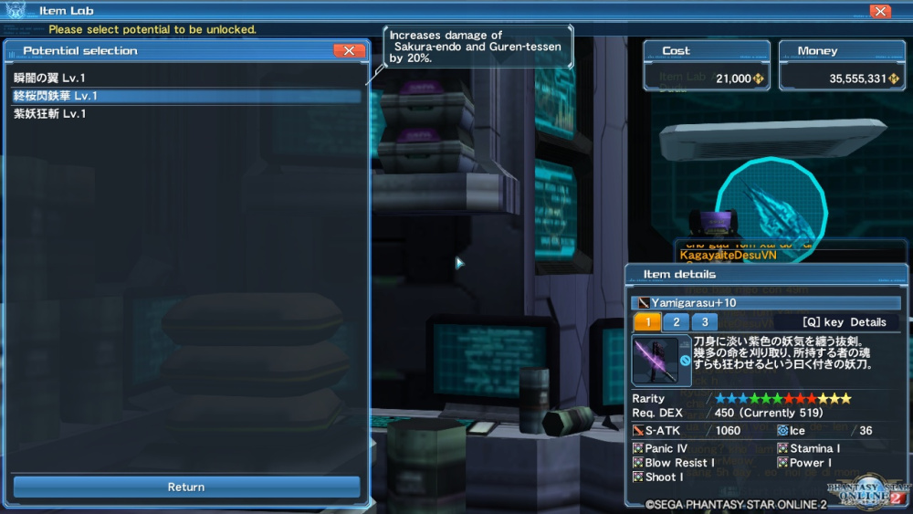 | 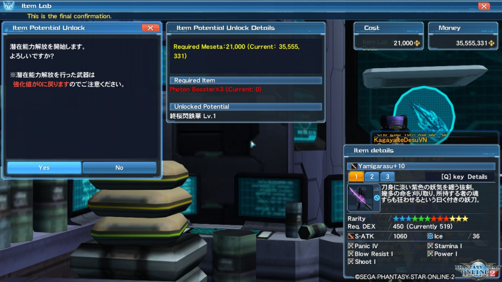

## I
#### IW: 
Iron Will, skill tree của HU, có tỉ lệ sống sót với 1HP nếu dmg từ mob/boss gây lớn hơn số HP hiện tại

## J
#### JA: 
Jusst Attack, khi xài nor atk hay PA/Technique, sẽ xuất hiện vòng màu xanh rồi nhỏ lại thành màu đỏ, nếu nor atk hay PA/Techni đúng vòng màu đỏ sẽ được buff thêm dmg

#### JG:
Just Guard: (cách gọi cho mấy weap của HU) khi chặn đòn thành công từ mob/boss,miss JA thì nó thành [Guard](thuat_ngu.md#guard)

## K
#### KC: 
Katana Combat: skill kích hoạt của BR, trong 20s dựa trên số hit và lượng dmg gây ra, sẽ gây dmg diện rộng có bán kính khoảng 2,3 step tính từ char khi finish

#### Keyword - Secret Phase: 
1 đoạn chữ để lấy quà, bằng cách chat nó trong game
>Say the phrase **アワード連続受賞おめでとう** in chat to receive:
> * 100 SG Ticket (x1)
> * +100% Tribooster (x2)
> * Free Salon Pass (x1)
như phía trên thì **アワード連続受賞おめでとう** là keyword, giờ thì copy / paste nó vô chat log trong game và nhận quà ở visiphone

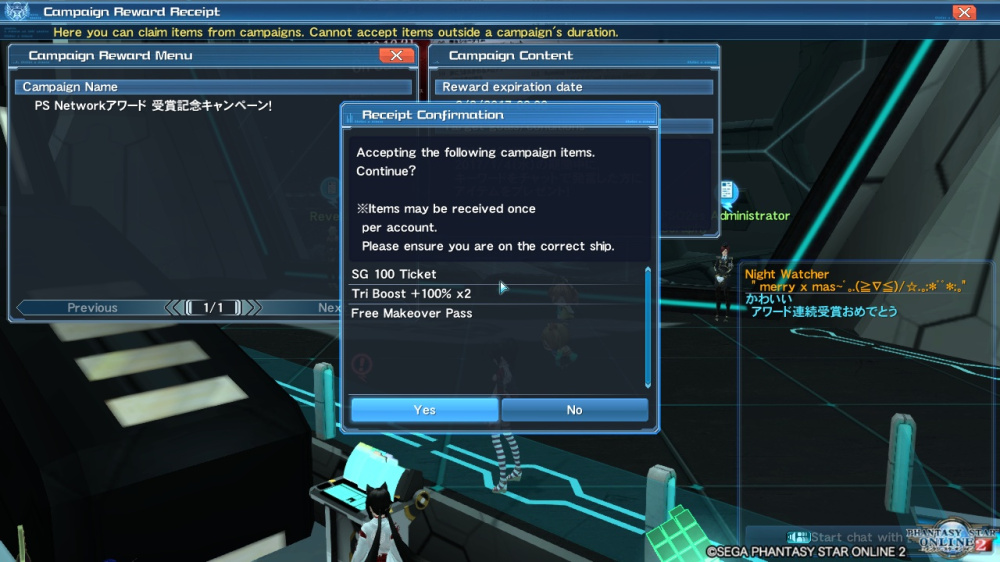

#### Kuronite: 
gọi chung cho mob/boss ở Planet Hatokan (Map Shironia/ Kuron)

## L
#### LA: 
Lobby Action, các hành động có thể làm trong game, Tăng thêm nhiều hoạt động bằng cách xài ticket LA

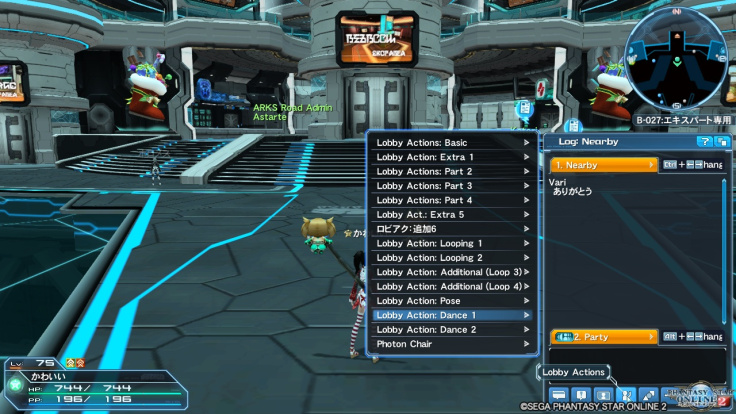

#### LB: 
Limit Break, con hàng ngon nhất của FI, giảm max HP nhưng buff dmg

#### LQ: 
Limited Quest: Quest giới hạn, cái này tùy event sẽ có

#### Layer wear: 
[Ou] Outer layer, [Ba] Base layer, [In] Inter layer. Lên ep4 segay update layer wear (Bản nâng cấp của cos). [Ou] cơ bản giống cos, không có gì đặc biệt,  [Ba] giống [Ou] nhưng lại không tốn slot bag, và nó nằm bên dưới cos với [Ou]. [In]: giống [Ba] nhưng nó là đồ lót, nằm bên dưới [Ba].
Tưởng tượng trang phục của char có 3 lớp. Tính từ ngoài vào trong Cos và [Ou] > [Ba] > [In]
Nếu xài cos thì không xài được [Ou], 2 cái này không xài chung được với nhau vì cùng 1 lớp. [In] với [Ba] thì thoải mái xài
Cái hay ở đây là có thẻ kết hợp [In], [Ba], Cos, [Ou] từ nhiều bộ khác nhau để ra trang phục mình mong muốn. Cứ theo cơ chế lớp ngoài hở thì lộ ra lớp dưới! VD như  [Ascendant Flame [In]](http://bumped.org/psublog/wp-content/uploads/2016/12/Ascendant-Flame-In-Colors.jpg) +  [Avent Lace [Ba]](http://bumped.org/psublog/wp-content/uploads/2016/12/Avent-Lace-Ba-Colors.jpg) +  [Melty Christmas [Ou]](http://bumped.org/psublog/wp-content/uploads/2016/12/Melty-Christmas-Ou-Colors.jpg).

## M
#### Mate: 
monomate / dimate / trimate, items hồi máu trong game

#### Mag: 
[PSO2- Mag](https://3ktan.wordpress.com/2016/08/12/pso2-mag/)

#### Mes: 
Meseta, loại tiền cơ bản trong game. Drop khi đi Quest, có thể chọn tự động nhặt mes trong option > basic setting > basic setting, chọn enable

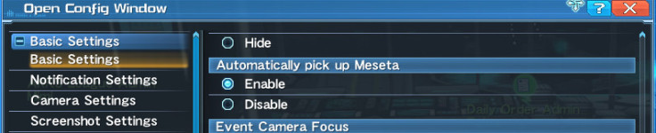

#### Mech: 
Gọi chung cho mob/boss ở Planet Lilipar (map Desert / Tunnel / Quarry )

#### MB:
Matter Board: [story](other/story.md#ep1--ep3) ep 1-3

## N
#### NT: 
New Type weap. Xem thêm [Pso2- New Type Weapon – NT weapon](https://3ktan.wordpress.com/2016/06/27/pso2-new-type-weapon-nt-weapon-2/)
Có thêm thanh Grind EXP, cách thức grind cũng khác so với [OT](thuat-ngu.md#ot)

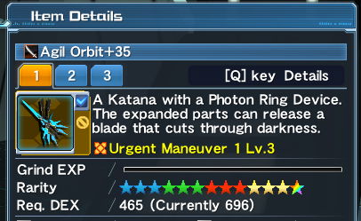

##### Nor atk: 
Normal Attack: đánh thường

##### N: 
Normal Mode: chế độ thường, mob/boss lvl 1+

#### Native: 
Động vật hoang dã =))) 
Gọi chung cho mob/boss ở Planet Naber (map Forest, Tundra. Ruin là map đặc biệt, mặc dù ở Naber nhưng nó là cái ổ Darker nên không tính)

## O
#### OT: 
Old Type, weap loại vũ, không có thanh exp, ngược với [NT](thuat-ngu.md#nt).
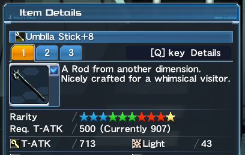

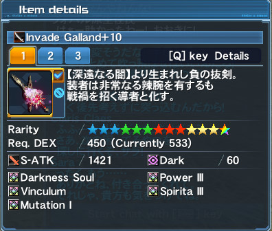

#### Ocean: 
gọi chung cho mob/boss ở Planet Vopar (Map Coast / Seabed / Facly)

## P
#### PA: 
Photon Art: kĩ năng: Khá đang dạng, và nó theo từng loại weap

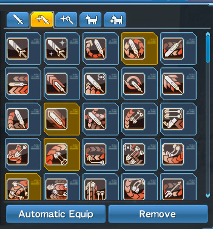

#### PB: 
Photon Blast, skill dặc biệt của mag, có thể xài sau khi char gây đủ dmg hoặc ăn đủ dmg [PSO2- Mag](https://3ktan.wordpress.com/2016/08/12/pso2-mag/)

#### Pot: 
Potential, khả năng đặc biệt của weap sau khi grind đến 1 lvl nhất định

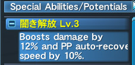

Tương tự ta có **unpot:** mở Potential của weap

#### Pts: 
point, nhiều Q sẽ có pts, Kiếm pts để clear Q hoặc boost cho char

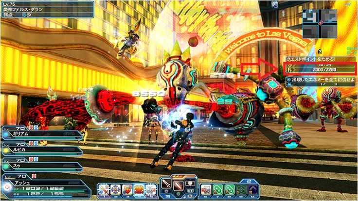

#### Phantom: 
gọi chung cho mob/boss ở Planet Earth (map Tokyo / Las Vegas)

## Q
#### Quest: 
chỉ mấy bản đồ để mình đi.

## R
Req: chỉ số yêu cầu. Chỉ số hiện tại (curently) phải lớn hơn hoặc bằng req thì mới có thể sử dụng được unit/weap.

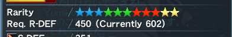

#### Ring: 
[PSO2 JP_Ring & Gathering](https://3ktan.wordpress.com/2016/06/24/pso2-jp_ring-gathering/)

#### Rare: 
những items 7* trở lên

#### Rare boss, Rare mob: 
những con quái hiếm, khác so với những con cùng loại. Drop disc hiếm, nhiều hp và exp hơn. Ảnh dưới là Rare Bal Robos: Bal Dominus

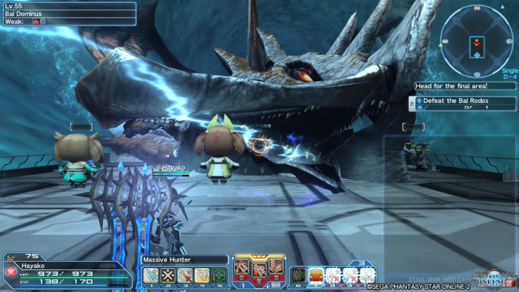

#### RS skill pass: reset all skill tree pass: 
item để reset lại toàn bộ tree của mọi class. Có thể mua bằng 500AC. Hoặc lâu lâu segay cho. 1 char sẽ có 1 pass, vậy nên mới chơi cứ tạo 3 char để đó, segay sẽ cho 3 reset pass về xài.

#### Regular Classes: 
class thường: FI, FO, TE, BO, BR, GU, RA, HU, SU (mấy class từ ep 4 đổ lại)

## S
#### Su: 
Class Summoner (bọn bạo hành động vật :v )

#### SA: 
Symbol Art, mấy cái hình người chơi có thể đưa vào game, câu lệnh: /symbol [số slot]. VD: /symbol4

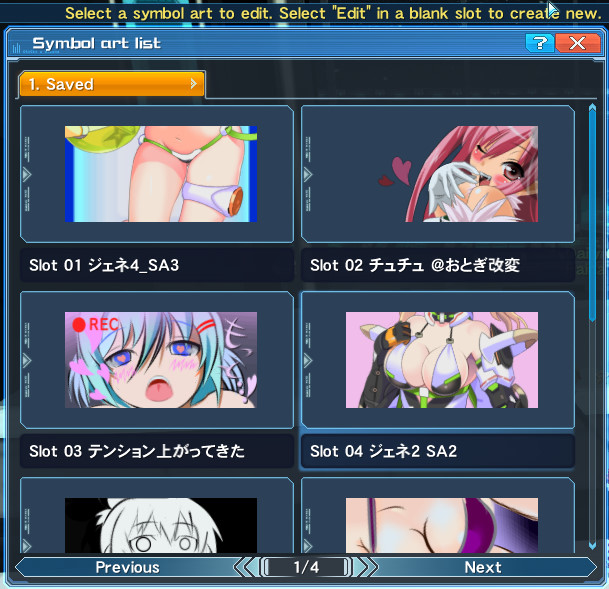

#### SH: 
Super Hard Mode: mob/boss lvl 61+

#### SG: 
Star Gem: đơn vị tiền chỉ kiếm được qua title, [Arks Leagen](https://3ktan.wordpress.com/2016/12/04/pso2_arks-league-riding-quest/), Bingo

#### Sk tree: 
skill tree

#### SAF: 
special ability factor, xem thêm: [PSO2_Special abi](https://3ktan.wordpress.com/2017/01/02/pso2_special-abi/)

#### SSA:
[Super Special Abilities](https://3ktan.wordpress.com/2017/12/27/super-special-abilities-ssa-s-class-abilities/): từ 20/12/2017 đánh dấu sự xuất hiện của SSA. Cũng như affix abi, cơ mà rate nó 100%

#### SP: 
skill point

## T
#### TE: 
Class  Techer

#### Techni: 
Technique: kĩ năng đa dạng, có 6 loại ele chủ yếu. Mỗi ele có 7 techni

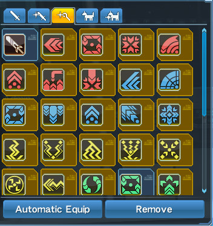 |

#### TAJAB: 
Techs Arts Just Attack Bonus: skill tree của FI, tăng dmg khi JA liên tục bằng những technique/PA khác nhau

#### TEQ: 
Team EQ, mọi người trong team đi EQ cùng với nhau thôi, không có người ngoài. Mục đích vui + tryhard :v :v

#### Time Abi: 
xem thêm [Pso2 – Craft Items + NPC Zieg](https://3ktan.wordpress.com/2016/07/01/pso2-npc-zieg-craft-items/)

#### Type 0: 
xem thêm [Pso2 – Craft Items + NPC Zieg](https://3ktan.wordpress.com/2016/07/01/pso2-npc-zieg-craft-items/), [PSO2_Craft Type 0](https://3ktan.wordpress.com/2016/11/05/pso2_craft-type-0/)

#### TAXQ: 
~~Time Attack Extreme Quest, ám chỉ COs của Klotho (F2 Lobby)~~.

Khi lên Ep6 Sega đã sửa lại TAXQ, thêm vào đó là [Arks Missions](thuat_ngu.md#arks-missions). 

[Các COs của Klotho bị thay thế và giảm reward](http://www.bumped.org/psublog/countdown-to-pso2-starsepisode-6/).

## U
#### Unit: 
trang bị. Game có 4 loại trang bị ứng vs 3 chỗ trên cơ thẻ: Rear (lưng), Arm (tay), Leg (chân), Sub (lắp vô lưng, tay hay chân cũng được)

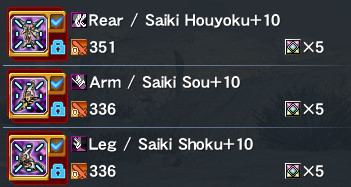

#### UQ: 
Ultimate Quest: Q với lvl mob/boss 80, tốc độ thì nhanh, khôn lỏi mà dmg lại đau hơn nữa còn xồn xồn lao đến nữa. ~~Không nhầm lẫn với UQ bên sea~~

## V
#### VH: 
Very Hard Mode: mob/boss lvl 41+

## W
#### Weap: 
weapon, vũ khí, trong game vũ khí khá đang dạng. Không gọi là wp tránh nhầm lẫn với weak point

#### wp: 
Weak Point: điểm yếu, mỗi boss/mob đều có những điểm yếu riêng. Đánh trúng chỗ thì dmg sẽ tăng thêm

#### Weak Ele: 
Weak Element: nguyên tố yếu nhất, xài techni thuộc trùng với weak ele sẽ được tính thêm dmg. VD boss weak Fire thì xài techni Fire như: Foie, Safoie….. Trong game sẽ hiển thị weak ele nên sẽ không có gì khó khăn cả

#### WB: 
Weak Buillet, skill kich hoạt của RA, bắn ra đạn trúng chỗ nào của mob/boss thì khi gây dmg vào chỗ đó dmg sẽ được tăng thêm.

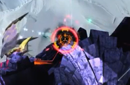

## X
#### XH: 
Extra Hard, mob/boss lvl 70+

#### XQ:
Extreme Quest: 1 Quest dạng 5 stage, vượt qua stage trước để tới stage sau, mỗi stage sẽ có nhưng yêu cầu khác nhau đề nghị người chơi làm theo. Nếu k hoàn thành yêu cầu thì stage sẽ sẽ gặp bất lợi như bị resis weap/element, ngược lại nếu hoàn thành sẽ được buff weap/element

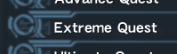

## Y

## Z
#### Z mode: 
góc nhìn từ vai của nhân vật (phím Z)

## # Khác
#### Vấn đề Dash trong game:  
di chuyển với khoảng cách ngắn: mục đích là né skill boss/mobs, rút ngắn khoảng cách,…) chia ra 3 loại: roll, step, mirage scape
* **Step:**(gunslash, knuck, DS, WL, sword, TD, pazi, JB, DB, wand có wand lover). đơn giản lao đến thôi.
* **roll:** (tmg, rif, launcher) lộn 1 vòng
* **mirage escape** (talis, rod, tack, wand không có wand lover): miễn nhiễm sát thương khi xài, nhưng 1 khi đặt chân xuống thì khoảng khắc đó là sấp mặt nếu bị boss vả
phải phân loại rõ vì game phân loại ra từng weap, cũng có skill tree + thêm với ring cho từng loại nữa. VD như ring slow roll thì chỉ xài được cho roll (chỉ xài cho tmg , rif, launcher) mirage escape với step sẽ khoogn xài được.
#### 630: 
Lỗi mất kết nối, gọi vui là 630-sama =)))

=========================================================================

**Đang cập nhật thêm.

Có gì không biết hay cần chỉnh sửa xin liên hệ qua Discord: `_Atan_#0333` **

